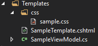
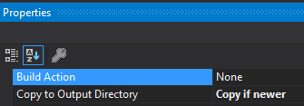

[](https://ci.appveyor.com/project/giacomelli/Razor2Pdf)
[](https://sonarcloud.io/dashboard?id=Razor2Pdf)
[](https://sonarcloud.io/dashboard?id=Razor2Pdf)
[](https://raw.githubusercontent.com/giacomelli/Razor2Pdf/master/LICENSE)
[](https://www.nuget.org/packages/Razor2Pdf/)

Razor2Pdf is a easy-to-use, cross-platform library to build PDF files from Razor template files.

--------

## Setup

```shell
install-package Razor2Pdf
```

## Usage

### From library or console application 
```csharp
var templateService = new TemplateService();
var builder = new PdfBuilder(templateService);
builder.WebSettings.UserStyleSheet = "Templates/css/sample.css";

var pdfData = await builder.BuildAsync("Templates/SampleTemplate", new SampleViewModel());

File.WriteAllBytes("sample.pdf", pdfData);
```

### From Web Api or Web App
```csharp
[HttpGet]
public async Task<FileResult> Pdf()
{
    var templateService = new TemplateService();
    var builder = new PdfBuilder(templateService);
    builder.WebSettings.UserStyleSheet = "Templates/css/sample.css";

    var pdfData = await builder.BuildAsync("Templates/SampleTemplate", new SampleViewModel());

    return new FileContentResult(pdfData, "application/pdf");            
}
```

### Configuring templates 
There are few configurations you must do on project where you will generate the PDF files from Razor templates:

**PreserveCompilationContext**: open the .csproj file and add the elemente bellow in the first `PropertyGroup`:
```xml
<PreserveCompilationContext>true</PreserveCompilationContext>
```
> It seems that web api/app do not need this configuration, but libraries and console applications does.

**Templates folder structure**: create a folder where your Razor templates (.cshtml) files will be saved. 



> If you want to have an external .css file on your templates, you can add it to this folder too (or a sub folder).

The .cshtml and .css files property `Copy to Output Directory` must be set to `Copy if newer`.  


 
## Samples
If you want to run the console, Web Api and Web App samples, just fork this repository and run them directly from solution.

--------

## How it works?
Razor2Pdf use two other .NET libraries to get the job done, first it use the [RazorLight](https://github.com/toddams/RazorLight/) to render the Razor template to HTML, after that it use the [DinkToPdf](https://github.com/rdvojmoc/DinkToPdf) (a wrapper to wkhtmltopdf native library) to generate a PDF from the HTML.

## FAQ
Having troubles? 

- Read our [wiki](https://github.com/giacomelli/Razor2Pdf/wiki).
- Tutorials
   - [Creating PDF from Razor templates with Razor2Pdf](http://diegogiacomelli.com.br/creating-pdf-from-razor-templates-with-razor2pdf/)
- Open an [issue](https://github.com/giacomelli/Razor2Pdf/issues).

--------

## How to improve it?

Create a fork of [Razor2Pdf](https://github.com/giacomelli/Razor2Pdf/fork). 

Did you change it? [Submit a pull request](https://github.com/giacomelli/Razor2Pdf/pull/new/master).

## License
Licensed under the The [MIT License (MIT)](LICENSE).
In others words, you can use this library for developement any kind of software: open source, commercial, proprietary, etc.